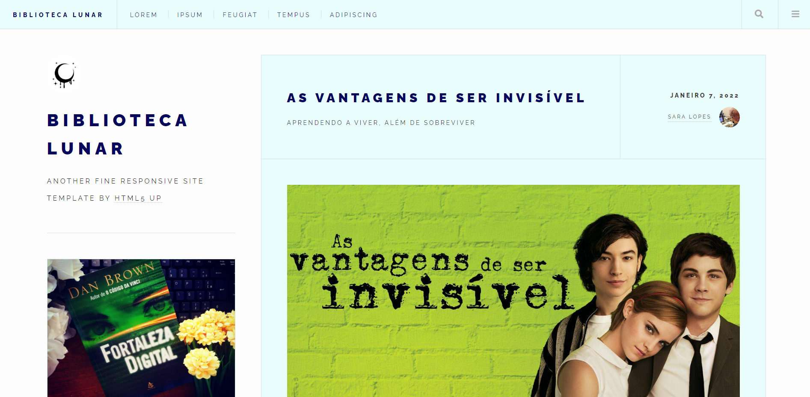

# Biblioteca Lunar 🌙

🧷 Link do site: https://lunasread.netlify.app/ 

Templete usado: 

Future Imperfect by HTML5 UP
html5up.net | @ajlkn
Free for personal and commercial use under the CCA 3.0 license (html5up.net/license)

It's been a long time coming, but I've finally gotten around to creating a brand new
blog-style template (and the first since Striped, which came out waaaaay back in 2013).
Anyway, Future Imperfect features a clean, expansive layout, a toggleable search box,
and -- because pretty much all modern browsers can use it now -- a whole lot of flexbox
action. Enjoy it :)

Demo images* courtesy of Unsplash, a radtastic collection of CC0 (public domain) images
you can use for pretty much whatever.

(* = not included)

AJ
aj@lkn.io | @ajlkn

Credits:

	Demo Images:
		Unsplash (unsplash.com)

	Icons:
		Font Awesome (fontawesome.io)

	Other:
		jQuery (jquery.com)
		Responsive Tools (github.com/ajlkn/responsive-tools)
